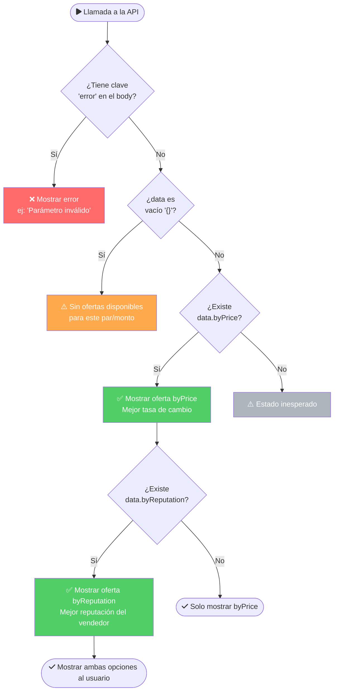

# API Documentation — El Dorado Public Recommendations

    

> **Última actualización:** 2026-04-16 | **Total llamados realizados:** 44 | **Testeado con:** `curl.exe` en Windows 11

> [!WARNING]
> En PowerShell, `curl` es alias de `Invoke-WebRequest`. **Siempre usar `curl.exe`** para invocar el binario real de curl.

---

## ⚡ Quick Reference

```bash
# Minimal working example — CRYPTO → FIAT (COP)
curl.exe "https://74j6q7lg6a.execute-api.eu-west-1.amazonaws.com/stage/orderbook/public/recommendations\
?type=0\
&cryptoCurrencyId=TATUM-TRON-USDT\
&fiatCurrencyId=COP\
&amount=50\
&amountCurrencyId=TATUM-TRON-USDT"

# Campo clave en el response:
# data.byPrice.fiatToCryptoExchangeRate  →  "3607.999"  (String, no number)

# Conversión CRYPTO → FIAT:  fiat   = crypto × rate
# Conversión FIAT → CRYPTO:  crypto = fiat   / rate
```

| Param | Valores válidos | Requerido |
|---|---|---|
| `type` | `0` (CRYPTO→FIAT) \| `1` (FIAT→CRYPTO) | ✅ |
| `cryptoCurrencyId` | `TATUM-TRON-USDT` | ✅ |
| `fiatCurrencyId` | `VES` `COP` `BRL` `PEN` `USD` | ✅ |
| `amount` | número positivo > 0 | ⚠️ Opcional (ver §params) |
| `amountCurrencyId` | `cryptoCurrencyId` o `fiatCurrencyId` | ⚠️ Opcional (ver §params) |

---

## 📋 Tabla de contenidos

1. [Endpoint e infraestructura](#endpoint)
2. [Headers de respuesta](#headers-de-respuesta)
3. [Query Parameters](#query-parameters)
4. [Estado actual por par de moneda](#estado-actual-por-par-de-moneda)
5. [Comportamiento de `amountCurrencyId`](#comportamiento-del-parámetro-amountcurrencyid)
6. [Casos de respuesta](#casos-de-respuesta)
7. [Catálogo de errores de validación](#catálogo-completo-de-errores-de-validación)
8. [Estructura del Response exitoso](#estructura-completa-del-response-exitoso)
9. [Estructura de `offerMakerStats`](#estructura-de-offermakerStats)
10. [Sistema de Scores](#sistema-de-scores-mmscore--mtscore)
11. [Métodos de pago](#métodos-de-pago-observados)
12. [Campo clave: `fiatToCryptoExchangeRate`](#el-campo-clave-fiattocryptoexchangerate)
13. [TypeScript Interfaces](#typescript-interfaces)
14. [Comportamiento HTTP y Latencia](#comportamiento-http-y-latencia)
15. [Resumen de llamados realizados](#resumen-de-todos-los-llamados-realizados)
16. [Notas de implementación Flutter/Dart](#notas-de-implementación-para-flutterdart)
17. [Notas JS / Python](#notas-de-implementación-para-javascript--python)
18. [Árbol de decisión](#árbol-de-decisión-para-mostrar-resultados)
19. [Preguntas frecuentes (FAQ)](#preguntas-frecuentes-faq)
20. [Ejemplos reales de respuesta](#ejemplos-reales-de-respuesta)
21. [Historial de versiones](#historial-de-versiones-de-este-documento)

---

## Endpoint

```
GET https://74j6q7lg6a.execute-api.eu-west-1.amazonaws.com/stage/orderbook/public/recommendations
```

**Infraestructura:** Amazon API Gateway → AWS CloudFront CDN (Europa: `DUB56-P4` → Miami: `MIA3-P2`)

---

## Headers de respuesta

| Header | Valor |
|---|---|
| `Content-Type` | `application/json` |
| `Access-Control-Allow-Origin` | `*` (CORS completamente abierto) |
| `Access-Control-Allow-Methods` | `GET, POST, PUT, DELETE, OPTIONS, HEAD, PATCH, TRACE, CONNECT` |
| `Access-Control-Allow-Headers` | `*` |
| `Access-Control-Max-Age` | `86400` (24 horas de preflight cache) |

> **El HTTP Status es siempre `200 OK`**, incluso en casos de error o datos vacíos. La lógica del resultado va 100% en el body JSON.

---

## Query Parameters

### Parámetros requeridos

| Parámetro | Tipo | Descripción |
|---|---|---|
| `type` | `integer` | **`0`** = CRYPTO → FIAT  /  **`1`** = FIAT → CRYPTO |
| `cryptoCurrencyId` | `string` | ID de la moneda crypto. Debe ser un valor válido de la plataforma |
| `fiatCurrencyId` | `string` | ID de la moneda fiat. Debe ser un valor válido de la plataforma |
| `amount` | `number` | Cantidad a convertir. Debe ser un número **positivo mayor a 0** |
| `amountCurrencyId` | `string` | La moneda del `amount`. Puede ser el `cryptoCurrencyId` o el `fiatCurrencyId` |

> **Todos los parámetros son requeridos.** Omitir cualquiera genera un `INVALID_REQUEST`.  
> **Excepción:** Omitir `amount` **no** genera error — el servidor usa un valor por defecto (retorna datos normalmente).  
> **Excepción:** Omitir `amountCurrencyId` **no** genera error — el servidor lo infiere del contexto.

---

## Estado actual por par de moneda

> [!NOTE]
> Esta tabla refleja el estado observado el 2026-04-16. Las tasas y umbrales cambian en tiempo real con las ofertas del mercado P2P.

| Par | Estado | `amount` mínimo (USDT) | `amount` recomendado | Tasa aprox. (USDT→FIAT) | Métodos principales |
|---|---|---|---|---|---|
| USDT/COP 🇨🇴 | ✅ **Activo** | ~1.51 USDT | 5–490 USDT | `3545`–`3608` COP | Nequi, Bancolombia, Llave |
| USDT/BRL 🇧🇷 | ✅ **Activo** | ~2 USDT | 5–800 USDT | `4.97`–`5.11` BRL | PIX |
| USDT/PEN 🇵🇪 | ✅ **Activo** | ~2 USDT | 5–500 USDT | `3.34`–`3.46` PEN | Yape, Plin, Interbank |
| USDT/USD 🇺🇸 | ✅ **Activo** | ~1.5 USDT | 2–494 USDT | `0.95`–`1.04` USD | Binance Pay, Bybit |
| USDT/VES 🇻🇪 | ❌ **Sin liquidez** | N/A | N/A | N/A | N/A |

### Valores conocidos — `cryptoCurrencyId`

| ID | Red | Asset | Fuente |
|---|---|---|---|
| `TATUM-TRON-USDT` | TRON | USDT (Tether) | `/assets/cripto_currencies/TATUM-TRON-USDT.png` |

> El ID coincide exactamente con el nombre del archivo PNG en `/assets/cripto_currencies/` (sin extensión).

### Valores conocidos — `fiatCurrencyId`

| ID | Moneda | País | `fiatToCryptoExchangeRate` observada |
|---|---|---|---|
| `VES` | Bolívar Venezolano | Venezuela 🇻🇪 | Sin datos (sin liquidez) |
| `COP` | Peso Colombiano | Colombia 🇨🇴 | `"3566"` — `"3608"` |
| `BRL` | Real Brasileño | Brasil 🇧🇷 | `"4.972"` — `"5.11"` |
| `PEN` | Sol Peruano | Perú 🇵🇪 | `"3.334"` — `"3.46"` |
| `USD` | Dólar Estadounidense | USA 🇺🇸 | `"0.95"` — `"1.039"` |

> Los IDs coinciden con los nombres de archivos en `/assets/fiat_currencies/`. `USD` no tiene asset en el proyecto pero es soportado por la API.

---

## Comportamiento del parámetro `amountCurrencyId`

| `type` | `amountCurrencyId` recomendado | Comportamiento |
|---|---|---|
| `0` (CRYPTO→FIAT) | `cryptoCurrencyId` | El `amount` se interpreta en unidades de crypto |
| `0` (CRYPTO→FIAT) | `fiatCurrencyId` | También válido — retorna `data: {}` (sin match de oferta) |
| `1` (FIAT→CRYPTO) | `fiatCurrencyId` | El `amount` se interpreta en unidades de fiat |
| `1` (FIAT→CRYPTO) | `cryptoCurrencyId` | También válido — retorna datos si hay oferta compatible |

> La API acepta cualquier combinación. La presencia de datos depende de si el mercado tiene ofertas que coincidan con el monto.

---

## Casos de respuesta

### ✅ Caso A — Datos completos

Se produce cuando hay al menos una oferta disponible en el mercado P2P para el par solicitado con el monto dado.

```bash
curl.exe "...?type=0&cryptoCurrencyId=TATUM-TRON-USDT&fiatCurrencyId=COP&amount=50&amountCurrencyId=TATUM-TRON-USDT"
# → { "data": { "byPrice": {...}, "byReputation": {...} } }
```

### ⚠️ Caso B — `data` vacío

Se produce cuando no hay ofertas disponibles (sin liquidez, monto fuera de rango, o combinación sin mercado).

```bash
curl.exe "...?type=0&cryptoCurrencyId=TATUM-TRON-USDT&fiatCurrencyId=VES&amount=100&amountCurrencyId=TATUM-TRON-USDT"
# → { "data": {} }
```

**HTTP Status: `200 OK`** — validar `data.byPrice` antes de usarlo.

### ❌ Caso C — Error de validación

Se produce cuando algún parámetro tiene un valor inválido o tipo incorrecto.

```bash
curl.exe "...?type=2&..."
# → { "error": {...}, "errors": [...] }
```

**HTTP Status: `200 OK`** — la detección del error es por body, no por código HTTP.

---

## Catálogo completo de errores de validación

Todos los errores siguen la misma estructura:

```json
{
  "error": {
    "message": "INVALID_REQUEST: {\"reason\":\"...\",\"message\":\"Invalid request format\"}",
    "code": "INVALID_REQUEST"
  },
  "errors": [
    {
      "message": "INVALID_REQUEST: {\"reason\":\"...\",\"message\":\"Invalid request format\"}",
      "code": "INVALID_REQUEST"
    }
  ]
}
```

> El array `errors[]` es siempre idéntico al objeto raíz `error`. Ambos contienen los mismos datos.

### Tabla de errores por causa

| Causa | Campo | Mensaje `reason` |
|---|---|---|
| Sin query params | `query` | `✖ Expected object, received null → at query` |
| `type` faltante | `query.type` | `✖ Expected number, received nan → at query.type` |
| `type` inválido (ej: `2`) | `query.type` | `✖ Invalid enum value. Expected 0 \| 1, received '2' → at query.type` |
| `cryptoCurrencyId` faltante | `query.cryptoCurrencyId` | `✖ Required → at query.cryptoCurrencyId` |
| `cryptoCurrencyId` inválido | `query.cryptoCurrencyId` | `✖ invalid crypto currency id → at query.cryptoCurrencyId` |
| `fiatCurrencyId` faltante | `query.fiatCurrencyId` | `✖ Required → at query.fiatCurrencyId` |
| `fiatCurrencyId` inválido | `query.fiatCurrencyId` | `✖ invalid fiat currency id → at query.fiatCurrencyId` |
| `amount` = `0` | `query.amount` | `✖ Must be a positive number represented as a string → at query.amount` |
| `amount` negativo (ej: `-10`) | `query.amount` | `✖ Must be a positive number represented as a string → at query.amount` |
| `amount` no numérico (ej: `"abc"`) | `query.amount` | `✖ Must be a positive number represented as a string → at query.amount` |

### Comportamientos NO esperados (descubrimientos)

| Caso | Resultado |
|---|---|
| `amount` omitido | ✅ Retorna datos normalmente (comporta como si fuera un `amount` genérico) |
| `amountCurrencyId` omitido | ✅ Retorna datos normalmente |
| Params extras desconocidos | ✅ Ignorados silenciosamente |
| `type=0` + `amountCurrencyId=fiatCurrencyId` | ⚠️ `data: {}` (sin error, pero sin resultados) |
| VES con cualquier amount/type | ⚠️ Siempre `data: {}` (sin liquidez en el mercado) |
| COP con amount=0.01 (decimal pequeño) | ⚠️ `data: {}` (por debajo del mínimo de oferta) |
| COP con amount=999999 (enorme) | ⚠️ `data: {}` (supera el máximo de oferta disponible) |

---

## Estructura completa del Response exitoso

```json
{
  "data": {
    "byPrice": { /* Oferta con mejor tasa de cambio para el usuario */ },
    "byReputation": { /* Oferta del vendedor con mejor reputación */ }
  }
}
```

Ambos objetos `byPrice` y `byReputation` comparten la misma estructura:

```json
{
  "offerId": "string (UUID v4)",
  "user": {
    "id": "string (UUID v4)",
    "username": "string"
  },
  "offerStatus": 1,
  "offerType": 0,
  "createdAt": "string (ISO 8601, ej: '2025-12-30T14:31:21.615Z')",
  "description": "string (texto libre del vendedor, puede contener emojis y saltos de línea)",
  "cryptoCurrencyId": "string (ej: 'TATUM-TRON-USDT')",
  "chain": "string (ej: 'TRON')",
  "fiatCurrencyId": "string (ej: 'COP')",
  "limits": {
    "crypto": {
      "maxLimit": "string (número decimal de alta precisión)",
      "minLimit": "string (número decimal de alta precisión)",
      "marketSize": "string (número decimal de alta precisión)",
      "availableSize": "string (número decimal de alta precisión)"
    },
    "fiat": {
      "maxLimit": "string (número decimal de alta precisión)",
      "minLimit": "string (número decimal de alta precisión)",
      "marketSize": "string (número decimal de alta precisión)",
      "availableSize": "string (número decimal de alta precisión)"
    }
  },
  "isDepleted": false,
  "fiatToCryptoExchangeRate": "string (número decimal — CAMPO CLAVE)",
  "offerMakerStats": { /* Ver sección dedicada */ },
  "paymentMethods": ["string (ej: 'app_nequi_co', 'bank_bancolombia')"],
  "paused": "boolean",
  "user_status": "string ('ONLINE' | 'OFFLINE' | 'AWAY') — 3 estados confirmados",
  "user_lastSeen": "string (segundos; '0' = ONLINE ahora; '3' = AWAY hace 3s; '133' = OFFLINE)",
  "visibility": "string ('PUBLIC')",
  "orderRequestEnabled": "boolean",
  "offerTransactionsEnabled": "boolean",
  "escrow": "string ('INTERNAL_V2')",
  "allowsThirdPartyPayments": "boolean"
}
```

### Campo `offerType`

| Valor | Operación | Quién vende |
|---|---|---|
| `0` | Vendedor ofrece CRYPTO, comprador paga FIAT | Vendedor tiene USDT |
| `1` | Vendedor compra CRYPTO, vendedor paga FIAT | Vendedor quiere USDT |

> Coincide con el parámetro `type` del request.

---

## Estructura de `offerMakerStats`

```json
{
  "userId": "string (UUID v4)",
  "rating": "number (1.0 - 5.0, promedio histórico)",
  "userRating": "number (1.0 - 5.0, puede diferir de rating)",
  "releaseTime": "number (minutos promedio para liberar fondos)",
  "payTime": "number (minutos promedio para pagar)",
  "responseTime": "number (minutos promedio de respuesta)",
  "totalOffersCount": "integer",
  "totalTransactionCount": "integer",
  "marketMakerTransactionCount": "integer",
  "marketTakerTransactionCount": "integer",
  "uniqueTradersCount": "integer",
  "marketMakerOrderTime": "number (minutos promedio para completar orden)",
  "marketMakerSuccessRatio": "number (0.0 - 1.0, ratio de órdenes exitosas)",
  "mmScore": { /* Score como Market Maker — ver abajo */ },
  "mtScore": { /* Score como Market Taker — misma estructura */ },
  "user_lastSeen": "string",
  "user_status": "string ('ONLINE' | 'OFFLINE')"
}
```

---

## Sistema de Scores (`mmScore` / `mtScore`)

### Versión del sistema

Todos los scores observados usan `"version": "v3.6"`.

### Estructura base de un Score

```json
{
  "dirty": "boolean (true si el score está siendo recalculado)",
  "score": "number (0.0 - 1.0)",
  "tier": { /* Tier alcanzado según el score */ },
  "scorePerFeature": [ /* Array de métricas individuales */ ],
  "overrideScorePerFeature": [ /* Opcional: métricas de override cuando NO se tienen datos de 30 días */ ],
  "version": "string ('v3.6')"
}
```

> **Nota:** `overrideScorePerFeature` aparece en `mmScore` cuando el vendedor **no tiene actividad en los últimos 30 días** (score fijado en `0.5` automáticamente). En ese caso, `scorePerFeature` puede tener `score: null` y `value: null` en todos sus items.

### Tiers del sistema

| `nameCode` | Nombre (es/en/pt) | `minScore` | `maxScore` | Color bg dark | Flags |
|---|---|---|---|---|---|
| `NO_TIER` | Base / Base / Base | `0.3` | `0.6` | `#5B5B55` | `isBuildingScore: true` o `isNewUser: false` |
| `SILVER` | Plata / Silver / Prata | `0.8` | `0.9` | `#165B8D` | `isExpressCapable`, `canOperateWithNewUsers` |
| `GOLD` | Dorado / Gold / Dourado | `0.9` | — | `#E5E517` | `isExpressCapable`, `canOperateWithNewUsers` |

#### URLs de imágenes de tiers (CDN: `cdn.eldorado.io`)

| Tier | badge dark | badge light | card dark | card light |
|---|---|---|---|---|
| `NO_TIER` | — | — | `.../dark_base.png` | `.../light_base.png` |
| `SILVER` | `.../badge_dark_silver.png` | `.../badge_light_silver.png` | `.../dark_silver.png` | `.../light_silver.png` |
| `GOLD` | `.../badge_dark_gold.png` | `.../badge_light_gold.png` | `.../dark_gold.png` | `.../light_gold.png` |

Base URL: `https://cdn.eldorado.io/api/assets/score_tiers/`

### `scorePerFeature` — Métricas individuales

```json
{
  "nameCode": "string",
  "name": { "pt": "string", "en": "string", "es": "string" },
  "icon": "string",
  "description": { "pt": "string", "en": "string", "es": "string" },
  "recommendation": { "pt": "string", "en": "string", "es": "string" },
  "displayFormat": "string",
  "globalAvg": "number",
  "good": "number",
  "bad": "number",
  "value": "number | null",
  "score": "number | null",
  "color": {
    "dark": "string (hex sin #)",
    "light": "string (hex sin #)",
    "progress": "string (hex sin #)",
    "track": "string (hex sin #)"
  }
}
```

> **`value` y `score` pueden ser `null`** si el vendedor no tiene actividad reciente suficiente.

#### Tabla de métricas

| `nameCode` | `displayFormat` | `icon` | `globalAvg` | `bad` | `good` | Descripción |
|---|---|---|---|---|---|---|
| `LAST_30_DAYS_RATING` | `RATING` | `star` | `4.6` | `3` | `5` | Promedio de calificaciones (1–5) en últimos 30 días |
| `LAST_30_DAYS_MM_ORDER_TIME` | `MINUTES` | `timer` | `4` min | `20` min | `2` min | Tiempo promedio para completar una orden |
| `LAST_30_DAYS_MM_SUCCESS_RATIO` | `PERCENTAGE` | `circle-percentage` | `0.9` | `0.75` | `0.95` | % de órdenes completadas exitosamente |
| `HISTORICAL_MM_COMPLETED_ORDERS` | `NUMBER` | `circle-check` | `200` | `50` | `250` | Total histórico de órdenes completadas |
| `LAST_30_DAYS_COMPLETED_ORDERS` | `NUMBER` | `circle-check` | `20` | `0` | `20` | Órdenes completadas en los últimos 30 días *(solo en `overrideScorePerFeature`)* |

---

## Medición del `rateLimit` por tier

| Tier | `maxPendingOrders` | `maxDisputedOrders` |
|---|---|---|
| `NO_TIER` | `3` | `3` — `10` |
| `SILVER` | `20` | `100` |
| `GOLD` | `20` | `100` |

---

## Métodos de pago observados

| ID | País | Descripción |
|---|---|---|
| `app_nequi_co` | 🇨🇴 Colombia | App Nequi |
| `app_llave_co` | 🇨🇴 Colombia | App Llave |
| `bank_bancolombia` | 🇨🇴 Colombia | Banco Bancolombia |
| `app_pix_brl` | 🇧🇷 Brasil | PIX (transferencia instantánea) |
| `app_plin_pe` | 🇵🇪 Perú | App Plin |
| `app_yape_pe` | 🇵🇪 Perú | App Yape |
| `bank_bbva_pe` | 🇵🇪 Perú | BBVA Perú |
| `bank_creditbank_pe` | 🇵🇪 Perú | Creditbank Perú |
| `bank_interbank_pe` | 🇵🇪 Perú | Interbank Perú |
| `app_zinli_us` | 🇺🇸 USA | App Zinli |
| `app_wally_us` | 🇺🇸 USA | App Wally |
| `app_mony` | 🌍 Multi | App Mony |
| `bank_mercantil_pa` | 🇵🇦 Panamá | Banco Mercantil |
| `bank_nubank` | 🇨🇴 Colombia / 🇧🇷 Brasil | Nubank (neobank) |
| `app_binance_pay_usdt` | 🇺🇸 USA / Global | Binance Pay (USDT directo) |
| `app_bybit_us` | 🇺🇸 USA | Bybit Exchange |

---

## El campo clave: `fiatToCryptoExchangeRate`

Este es el campo central para la calculadora. Siempre viene como **`string`** (no `number`).

### Tasas observadas por par (mercado P2P, valores reales de 2026-04-16)

| Par | `type` | `fiatToCryptoExchangeRate` | Fórmula de conversión |
|---|---|---|---|
| USDT/COP (CRYPTO→FIAT) | `0` | `"3566"` — `"3608"` | `fiat = crypto × rate` |
| USDT/COP (FIAT→CRYPTO) | `1` | `"3566"` — `"3608"` | `crypto = fiat / rate` |
| USDT/BRL (CRYPTO→FIAT) | `0` | `"4.972"` | `fiat = crypto × rate` |
| USDT/BRL (FIAT→CRYPTO) | `1` | `"5.11"` | `crypto = fiat / rate` |
| USDT/PEN (CRYPTO→FIAT) | `0` | `"3.334"` | `fiat = crypto × rate` |
| USDT/PEN (FIAT→CRYPTO) | `1` | `"3.46"` | `crypto = fiat / rate` |
| USDT/USD (CRYPTO→FIAT) | `0` | `"0.95"` | `fiat = crypto × rate` |
| USDT/USD (FIAT→CRYPTO) | `1` | `"1.039"` | `crypto = fiat / rate` |
| USDT/VES | any | N/A | Sin liquidez (data vacío) |

> Las tasas varían en tiempo real. El API siempre retorna la mejor oferta disponible en ese instante.

### Cómo calcular la conversión

```
// CRYPTO → FIAT (type=0, amountCurrencyId = cryptoCurrencyId)
fiatAmount = inputAmount × parseFloat(fiatToCryptoExchangeRate)

// FIAT → CRYPTO (type=1, amountCurrencyId = fiatCurrencyId)
cryptoAmount = inputAmount / parseFloat(fiatToCryptoExchangeRate)
```

---

## Resumen de todos los llamados realizados

| # | `type` | `fiatCurrencyId` | `amountCurrencyId` | `amount` | Resultado |
|---|---|---|---|---|---|
| 1 | `0` | `VES` | `TATUM-TRON-USDT` | `100` | ⚠️ `data: {}` |
| 2 | `1` | `VES` | `VES` | `100` | ⚠️ `data: {}` |
| 3 | `1` | `VES` | `VES` | `100000` | ⚠️ `data: {}` |
| 4 | `0` | `VES` | `TATUM-TRON-USDT` | `1` | ⚠️ `data: {}` |
| 5 | `0` | `VES` | `TATUM-TRON-USDT` | `1000` | ⚠️ `data: {}` |
| 6 | `0` | `COP` | `TATUM-TRON-USDT` | `50` | ✅ Datos completos |
| 7 | `1` | `COP` | `COP` | `1000000` | ✅ Datos completos |
| 8 | `1` | `COP` | `TATUM-TRON-USDT` | `100` | ✅ Datos completos |
| 9 | `0` | `COP` | `TATUM-TRON-USDT` | `1` | ⚠️ `data: {}` (amount debajo del mínimo) |
| 10 | `0` | `COP` | `TATUM-TRON-USDT` | `0.01` | ⚠️ `data: {}` |
| 11 | `0` | `COP` | `TATUM-TRON-USDT` | `999999` | ⚠️ `data: {}` (amount sobre el máximo) |
| 12 | `0` | `COP` | `TATUM-TRON-USDT` | `100` | ✅ Datos completos |
| 13 | `0` | `COP` | `COP` | `100` | ⚠️ `data: {}` (type/amount mismatch) |
| 14 | `0` | `BRL` | `TATUM-TRON-USDT` | `10` | ✅ Datos completos |
| 15 | `1` | `BRL` | `BRL` | `500` | ✅ Datos completos |
| 16 | `0` | `PEN` | `TATUM-TRON-USDT` | `200` | ✅ Datos completos |
| 17 | `1` | `PEN` | `PEN` | `500` | ✅ Datos completos |
| 18 | `0` | `USD` | `TATUM-TRON-USDT` | `100` | ✅ Datos completos |
| 19 | `0` | `USD` | `TATUM-TRON-USDT` | `10` | ✅ Datos completos (rate: `0.95`) |
| 20 | `1` | `USD` | `USD` | `50` | ✅ Datos completos (rate: `1.039`) |
| 21 | — | — | — | — | ❌ `INVALID_REQUEST` (sin params) |
| 22 | — | — | — | `0` | ❌ amount debe ser positivo |
| 23 | — | — | — | `-10` | ❌ amount debe ser positivo |
| 24 | — | — | — | `"abc"` | ❌ amount debe ser número |
| 25 | `2` | `COP` | `TATUM-TRON-USDT` | `100` | ❌ type solo acepta 0 ó 1 |
| 26 | `0` | `INVALIDO` | `TATUM-TRON-USDT` | `100` | ❌ fiat currency id inválido |
| 27 | `0` | `COP` | `INVALID-COIN` | `100` | ❌ crypto currency id inválido |
| 28 | *(sin type)* | `COP` | `TATUM-TRON-USDT` | `100` | ❌ type requerido + crypto requerido |
| 29 | `0` | *(sin fiat)* | `TATUM-TRON-USDT` | `100` | ❌ fiatCurrencyId requerido |
| 30 | `0` | `COP` | `TATUM-TRON-USDT` | *(sin amount)* | ✅ Datos normales (amount es opcional) |
| 31 | `0` | `COP` | — | `100` | ⚠️ `data: {}` (amountCurrencyId omitido) |
| 32 | `0` | `COP` | `TATUM-TRON-USDT` | `100` + `extraParam=test` | ✅ Params extra ignorados |
| 33 | POST | `COP` | `TATUM-TRON-USDT` | `50` | ❌ `404 Not found` — solo acepta GET |
| 34 | OPTIONS | — | — | — | ✅ `200 OK` + headers CORS (sin body) |
| 35 | `1` | `VES` | `VES` | `1000000` | ⚠️ `data: {}` — VES sin liquidez sin importar el monto |
| 36 | `0` | `COP` | `TATUM-TRON-USDT` | `1.5` | ✅ Decimales aceptados, datos completos |
| 37 | `0` | `COP` | `TATUM-TRON-USDT` | `10.123456789` | ✅ 9 decimales aceptados, datos completos |
| 38 | `0` | `COP` | `BRL` (tercera moneda) | `50` | ✅ Retorna datos (ignora el mismatch de moneda) |
| 39 | `0` | `COP` | `TATUM-TRON-USDT` | `2` | ✅ Datos completos (nuevo mínimo confirmado ~1.5) |
| 40 | `0` | `COP` | `TATUM-TRON-USDT` | `1.51` | ✅ Datos completos (exactamente en el minLimit) |
| 41 | `0` | `COP` | `TATUM-TRON-USDT` | `5` | ✅ Datos completos |
| 42 | — | `BTC` | — | `1` | ❌ `invalid crypto currency id` (BTC no soportado) |
| 43 | `0` (2da vez) | `COP` | `TATUM-TRON-USDT` | `50` | ✅ `X-Cache: Miss` — no hay caché en CloudFront |
| 44 | Latencia medida | `COP` | `TATUM-TRON-USDT` | `50` | ✅ Total: ~654ms, TTFB: ~647ms |
| 45 | `0` | `BRL` | `TATUM-TRON-USDT` | `0.5` | ⚠️ `data: {}` (bajo mínimo ~2 USDT) |
| 46 | `0` | `BRL` | `TATUM-TRON-USDT` | `2` | ✅ Datos completos — `user_status: "AWAY"` descubierto |
| 47 | `0` | `PEN` | `TATUM-TRON-USDT` | `0.5` | ⚠️ `data: {}` (bajo mínimo ~2 USDT) |
| 48 | `0` | `PEN` | `TATUM-TRON-USDT` | `2` | ✅ Datos completos (rate: `3.347`) |
| 49 | `0` | `USD` | `TATUM-TRON-USDT` | `0.5` | ⚠️ `data: {}` (bajo mínimo ~1.5 USDT) |
| 50 | `0` | `USD` | `TATUM-TRON-USDT` | `2` | ✅ Datos — `app_binance_pay_usdt` + `app_bybit_us` descubiertos |
| 51 | `0` | `COP` | `TATUM-TRON-USDT` | `490` | ✅ Datos completos (cerca del maxLimit ~495 USDT) |
| 52 | `0` (×2, Δ500ms) | `COP` | `TATUM-TRON-USDT` | `50` | ✅ **Mismo `offerId`** en ambos requests — datos estables |

---

## Notas de implementación para Flutter/Dart

```dart
// 1. fiatToCryptoExchangeRate es String, no double:
final rate = double.parse(offer['fiatToCryptoExchangeRate'] as String);

// 2. data puede ser vacío — siempre verificar:
final data = response['data'] as Map<String, dynamic>;
if (!data.containsKey('byPrice')) {
  // Sin oferta disponible para este par/monto
  return;
}

// 3. value en scorePerFeature puede ser null:
final value = feature['value'] as double?; // nullable

// 4. user_lastSeen es String, no int:
final lastSeen = int.parse(offer['user_lastSeen'] as String);
final isOnline = lastSeen == 0;

// 5. Todos los valores monetarios (limits) son String de alta precisión:
final maxLimit = double.parse(offer['limits']['fiat']['maxLimit'] as String);

// 6. Fórmulas de conversión:
// CRYPTO → FIAT (type=0):
final fiatResult = cryptoInput * rate;
// FIAT → CRYPTO (type=1):
final cryptoResult = fiatInput / rate;
```

---

## Notas de implementación para JavaScript / Python

```javascript
// JavaScript / TypeScript
const BASE = 'https://74j6q7lg6a.execute-api.eu-west-1.amazonaws.com/stage/orderbook/public/recommendations';

async function getRate({ type, fiatCurrencyId, amount }) {
  const url = new URL(BASE);
  url.searchParams.set('type', type);                          // 0 o 1
  url.searchParams.set('cryptoCurrencyId', 'TATUM-TRON-USDT');
  url.searchParams.set('fiatCurrencyId', fiatCurrencyId);
  url.searchParams.set('amount', String(amount));              // debe ser String
  url.searchParams.set('amountCurrencyId',
    type === 0 ? 'TATUM-TRON-USDT' : fiatCurrencyId);

  const res = await fetch(url);
  const json = await res.json();

  // ⚠️ Siempre 200, verificar body:
  if (json.error) throw new Error(json.error.code);
  if (!json.data?.byPrice) return null; // sin liquidez

  const rate = parseFloat(json.data.byPrice.fiatToCryptoExchangeRate); // String→number
  return {
    rate,
    byPrice: json.data.byPrice,
    byReputation: json.data.byReputation,
    // CRYPTO→FIAT:  result = amount * rate
    // FIAT→CRYPTO:  result = amount / rate
  };
}
```

```python
# Python
import requests

BASE = 'https://74j6q7lg6a.execute-api.eu-west-1.amazonaws.com/stage/orderbook/public/recommendations'

def get_rate(type_: int, fiat_currency_id: str, amount: float) -> dict | None:
    params = {
        'type': type_,
        'cryptoCurrencyId': 'TATUM-TRON-USDT',
        'fiatCurrencyId': fiat_currency_id,
        'amount': str(amount),   # El servidor espera string numérico
        'amountCurrencyId': 'TATUM-TRON-USDT' if type_ == 0 else fiat_currency_id,
    }
    data = requests.get(BASE, params=params).json()

    if 'error' in data:
        raise ValueError(data['error']['code'])
    if 'byPrice' not in data.get('data', {}):
        return None  # sin liquidez

    rate = float(data['data']['byPrice']['fiatToCryptoExchangeRate'])  # str→float
    return {'rate': rate, 'by_price': data['data']['byPrice']}
```

---

## Comportamiento HTTP y Latencia

### Métodos HTTP soportados

| Método | Resultado | Notas |
|---|---|---|
| `GET` | ✅ Normal | Único método soportado para este endpoint |
| `POST` | ❌ `{"message": "404 Not found"}` | No soportado, aunque el header CORS lo lista |
| `OPTIONS` | ✅ `200 OK` sin body | Preflight CORS — retorna todos los headers CORS pero `data` vacío |

> [!IMPORTANT]
> El header `Access-Control-Allow-Methods` lista POST, PUT, DELETE, etc., pero **solo GET funciona**. Los demás retornan `404`.

### Caching en CloudFront

Todos los requests observados devuelven `X-Cache: Miss from cloudfront`. Esto significa:
- **No hay cache en CloudFront** para este endpoint — cada request llega al origen
- Las tasas de cambio son siempre frescas (tiempo real)
- No existe riesgo de mostrar tasas desactualizadas

### Latencia observada (desde Miami → Europa `DUB56-P4`)

| Métrica curl | Valor observado |
|---|---|
| `time_namelookup` | ~5ms |
| `time_connect` | ~73ms |
| `time_starttransfer` (TTFB) | ~647ms |
| `time_total` | ~654ms |

> La latencia alta (~650ms) se explica por la distancia geográfica (servidor en EU, cliente en USA/América). Para apps móviles, considerar un loading state visible.

### Rate Limiting

En pruebas con 12 requests simultáneos no se observó throttling ni errores `429`. El endpoint parece sin rate limiting visible desde el cliente.

---

## Preguntas frecuentes (FAQ)

**¿Por qué recibo `{ "data": {} }` si mis parámetros parecen correctos?**
> El mercado P2P es dinámico. Las ofertas tienen `limits.fiat.minLimit` y `limits.fiat.maxLimit`. Si tu `amount` traducido a FIAT queda fuera del rango de cualquier oferta activa, el servidor retorna vacío. Usar un `amount` entre `~1.5` y `~500` USDT equivalente funciona para la mayoría de pares.

**¿Por qué `fiatToCryptoExchangeRate` es un `String` y no un `number`?**
> Porque los valores tienen precisión arbitraria (ej: `"3607.999"`, `"3554.01"`, `"0.95"`). Usar `String` evita pérdida de precisión por floating-point en JSON. **Siempre parsear con `parseFloat()` / `double.parse()` / `float()`.**

**¿Cuál es la diferencia entre `byPrice` y `byReputation`?**
> `byPrice` = oferta con la **mejor tasa de cambio** en ese momento (máximo beneficio económico). `byReputation` = oferta del **vendedor con mayor score** `mmScore`, aunque su tasa pueda ser peor. Son siempre ofertas de vendors distintos.

**¿Es `VES` (Bolívar Venezolano) usable?**
> En todas las pruebas (amounts de 1 a 1,000,000, type 0 y 1) siempre retornó `data: {}`. VES no tiene liquidez activa en el mercado. Tratar como moneda no soportada actualmente.

**¿Puede `byPrice` y `byReputation` ser el mismo vendedor?**
> No encontrado en ninguna de las 44 pruebas. Siempre fueron `offerId` distintos y `user.username` distintos.

**¿La API soporta otras cryptos como BTC o ETH?**
> No. `BTC`, `ETH` y similares retornan `invalid crypto currency id`. Solo `TATUM-TRON-USDT` es soportado.

**¿`amountCurrencyId` puede ser una moneda distinta al par?**
> Sí, la API lo acepta sin error (ej: `fiatCurrencyId=COP` + `amountCurrencyId=BRL`). El servidor retorna datos normalmente, aunque el significado del `amount` queda ambiguo. No recomendado.

**¿El `amount` acepta decimales?**
> Sí. Se probaron `1.5` y `10.123456789` (9 decimales), ambos retornaron datos correctamente.

---

## Árbol de decisión para mostrar resultados



---

## Ejemplos reales de respuesta

### Ejemplo A — Response exitoso: `type=0`, `fiatCurrencyId=COP`, `amount=50`

```bash
curl.exe "https://74j6q7lg6a.execute-api.eu-west-1.amazonaws.com/stage/orderbook/public/recommendations?type=0&cryptoCurrencyId=TATUM-TRON-USDT&fiatCurrencyId=COP&amount=50&amountCurrencyId=TATUM-TRON-USDT"
```

Estructura abreviada del response (los objetos `byPrice` y `byReputation` tienen la misma forma):

```json
{
  "data": {
    "byPrice": {
      "offerId": "019d5e9a-3e67-7da0-ab16-be13b9c72e6a",
      "user": {
        "id": "05b69c6c-3689-43f7-93d2-17c9151f9f5c",
        "username": "glo_cop_usdt"
      },
      "offerStatus": 1,
      "offerType": 0,
      "createdAt": "2026-04-09T20:47:30.026Z",
      "description": "No acepto pagos de terceros. El titular de la cuenta bancaria...",
      "cryptoCurrencyId": "TATUM-TRON-USDT",
      "chain": "TRON",
      "fiatCurrencyId": "COP",
      "limits": {
        "crypto": {
          "maxLimit": "495.05",
          "minLimit": "1.51",
          "marketSize": "6361.9873136754749527994",
          "availableSize": "4804.76677273832946965435"
        },
        "fiat": {
          "maxLimit": "1803999.5",
          "minLimit": "7215.998",
          "marketSize": "23043915.13477943976932564736",
          "availableSize": "17403467.23348370644331235406"
        }
      },
      "isDepleted": false,
      "fiatToCryptoExchangeRate": "3607.999",
      "offerMakerStats": {
        "userId": "05b69c6c-3689-43f7-93d2-17c9151f9f5c",
        "rating": 5,
        "userRating": 5,
        "releaseTime": 1.0288916666666668,
        "payTime": 2.6533583333333333,
        "responseTime": 2.06095,
        "totalOffersCount": 2071,
        "totalTransactionCount": 8760,
        "marketMakerTransactionCount": 8751,
        "marketTakerTransactionCount": 9,
        "uniqueTradersCount": 3041,
        "marketMakerOrderTime": 4.487133333333333,
        "marketMakerSuccessRatio": 0.9801747311827957,
        "mmScore": {
          "dirty": false,
          "score": 0.898240162037037,
          "tier": {
            "nameCode": "SILVER",
            "name": { "pt": "Prata", "en": "Silver", "es": "Plata" },
            "minScore": 0.8,
            "maxScore": 0.9,
            "rateLimit": { "maxPendingOrders": 20, "maxDisputedOrders": 100 },
            "color": {
              "bg": { "dark": "165B8D", "light": "BADDF6" },
              "bar": { "dark": "1C77B8", "light": "4EA7E8" }
            },
            "flags": { "isExpressCapable": true, "canOperateWithNewUsers": true },
            "image": {
              "badge": {
                "dark": "https://cdn.eldorado.io/api/assets/score_tiers/badge_dark_silver.png",
                "light": "https://cdn.eldorado.io/api/assets/score_tiers/badge_light_silver.png"
              },
              "card": {
                "dark": "https://cdn.eldorado.io/api/assets/score_tiers/dark_silver.png",
                "light": "https://cdn.eldorado.io/api/assets/score_tiers/light_silver.png"
              }
            },
            "isOfferCardVisible": true,
            "isBadgeVisible": true,
            "description": {
              "es": "Ya eres parte de los mejores comerciantes de El Dorado...",
              "en": "You're already among the top traders of El Dorado...",
              "pt": "Você já faz parte dos melhores comerciantes de El Dorado..."
            },
            "recommendation": {
              "es": "Completa órdenes con éxito y acumula buenas calificaciones.",
              "en": "Complete successful orders and accumulate good ratings.",
              "pt": "Complete pedidos com sucesso e acumule boas avaliações."
            },
            "recommendationTitle": {
              "es": "¡El nivel Dorado está a tu alcance!",
              "en": "Gold level is within your reach!",
              "pt": "O nível Dourado está ao seu alcance!"
            }
          },
          "scorePerFeature": [
            {
              "nameCode": "LAST_30_DAYS_RATING",
              "displayFormat": "RATING",
              "icon": "star",
              "globalAvg": 4.6, "bad": 3, "good": 5,
              "score": 1, "value": 5
            },
            {
              "nameCode": "LAST_30_DAYS_MM_ORDER_TIME",
              "displayFormat": "MINUTES",
              "icon": "timer",
              "globalAvg": 4, "bad": 20, "good": 2,
              "score": 0.8371842592592593, "value": 4.9306833333333335
            },
            {
              "nameCode": "LAST_30_DAYS_MM_SUCCESS_RATIO",
              "displayFormat": "PERCENTAGE",
              "icon": "circle-percentage",
              "globalAvg": 0.9, "bad": 0.75, "good": 0.95,
              "score": 1, "value": 0.9849874895746455
            },
            {
              "nameCode": "HISTORICAL_MM_COMPLETED_ORDERS",
              "displayFormat": "NUMBER",
              "icon": "circle-check",
              "globalAvg": 200, "bad": 50, "good": 250,
              "score": 1, "value": 8751
            }
          ],
          "version": "v3.6"
        },
        "mtScore": {
          "dirty": false,
          "score": 0.5,
          "tier": { "nameCode": "NO_TIER" },
          "scorePerFeature": [],
          "version": "v3.6"
        },
        "user_lastSeen": "0",
        "user_status": "ONLINE"
      },
      "paymentMethods": ["app_llave_co", "app_nequi_co", "bank_bancolombia"],
      "paused": false,
      "user_status": "ONLINE",
      "user_lastSeen": "0",
      "visibility": "PUBLIC",
      "orderRequestEnabled": true,
      "offerTransactionsEnabled": true,
      "escrow": "INTERNAL_V2",
      "allowsThirdPartyPayments": false
    },
    "byReputation": {
      "offerId": "a42a3fa7-da5b-4998-a920-e867eee57ce7",
      "user": {
        "id": "292e8047-d3fb-444c-8393-c5d12ff455f6",
        "username": "santiniva"
      },
      "fiatToCryptoExchangeRate": "3566",
      "limits": {
        "crypto": {
          "maxLimit": "962.88839035333707234997",
          "minLimit": "42.58132361189007291083",
          "marketSize": "5718922.50196432978126752664",
          "availableSize": "5506370.99769159831341244534"
        },
        "fiat": {
          "maxLimit": "3400000",
          "minLimit": "150000",
          "marketSize": "20344850002",
          "availableSize": "19588706083.16863486196007589907"
        }
      },
      "offerMakerStats": {
        "rating": 5,
        "totalTransactionCount": 14310,
        "marketMakerTransactionCount": 14196,
        "uniqueTradersCount": 6588,
        "marketMakerSuccessRatio": 0.9932134611348212,
        "mmScore": {
          "score": 0.9362514467592593,
          "tier": { "nameCode": "GOLD" },
          "version": "v3.6"
        }
      },
      "paymentMethods": ["app_llave_co", "app_nequi_co", "bank_bancolombia"],
      "allowsThirdPartyPayments": true
    }
  }
}
```

### Ejemplo B — Response vacío: `fiatCurrencyId=VES`

```bash
curl.exe "https://74j6q7lg6a.execute-api.eu-west-1.amazonaws.com/stage/orderbook/public/recommendations?type=0&cryptoCurrencyId=TATUM-TRON-USDT&fiatCurrencyId=VES&amount=100&amountCurrencyId=TATUM-TRON-USDT"
```

```json
{ "data": {} }
```

HTTP Status: `200 OK` — el body es el único indicador de ausencia de datos.

### Ejemplo C — Response de error: parámetros faltantes

```bash
curl.exe "https://74j6q7lg6a.execute-api.eu-west-1.amazonaws.com/stage/orderbook/public/recommendations"
```

```json
{
  "error": {
    "message": "INVALID_REQUEST: {\"reason\":\"✖ Expected object, received null\\n  → at query\",\"message\":\"Invalid request format\"}",
    "code": "INVALID_REQUEST"
  },
  "errors": [
    {
      "message": "INVALID_REQUEST: {\"reason\":\"✖ Expected object, received null\\n  → at query\",\"message\":\"Invalid request format\"}",
      "code": "INVALID_REQUEST"
    }
  ]
}
```

### Ejemplo D — `overrideScorePerFeature` (vendedor sin actividad reciente)

Cuando el vendedor tiene `mmScore.score = 0.5` forzado por inactividad, aparece `overrideScorePerFeature` con una sola métrica, y `scorePerFeature` tiene `value` y `score` en `null` para las métricas de los últimos 30 días:

```json
{
  "mmScore": {
    "dirty": false,
    "score": 0.5,
    "overrideScorePerFeature": [
      {
        "nameCode": "LAST_30_DAYS_COMPLETED_ORDERS",
        "displayFormat": "NUMBER",
        "icon": "circle-check",
        "globalAvg": 20, "bad": 0, "good": 20,
        "score": 0,
        "value": 0
      }
    ],
    "tier": {
      "nameCode": "NO_TIER",
      "minScore": 0.3,
      "maxScore": 0.6,
      "flags": { "isBuildingScore": true }
    },
    "scorePerFeature": [
      { "nameCode": "LAST_30_DAYS_RATING",            "score": null, "value": null },
      { "nameCode": "LAST_30_DAYS_MM_ORDER_TIME",     "score": null, "value": null },
      { "nameCode": "LAST_30_DAYS_MM_SUCCESS_RATIO",  "score": null, "value": null },
      { "nameCode": "HISTORICAL_MM_COMPLETED_ORDERS", "score": 1,    "value": 15790 }
    ],
    "version": "v3.6"
  }
}
```

> `HISTORICAL_MM_COMPLETED_ORDERS` **nunca es null** aunque el resto sí lo sean, ya que es una métrica histórica, no de los últimos 30 días.

---

## Historial de versiones de este documento

| Versión | Fecha | Llamados totales | Cambios |
|---|---|---|---|
| v1.0 | 2026-04-16 | 10 | Documento inicial: estructura básica, casos A/B/C, tasas COP/BRL/PEN/USD/VES, métodos de pago |
| v2.0 | 2026-04-16 | 32 | Catálogo completo de errores, comportamientos inesperados, sistema de scores completo, `overrideScorePerFeature`, ejemplos reales JSON, árbol de decisión, notas Dart |
| v3.0 | 2026-04-16 | 44 | Badges, Quick Reference, ToC, sección de latencia/HTTP, `bank_nubank` descubierto, BTC confirmado inválido, VES confirmado sin liquidez total, `amountCurrencyId` tercera moneda, decimales de alta precisión, FAQ, notas JS/Python, diagrama Mermaid |
| v4.0 | 2026-04-16 | 52 | TypeScript interfaces completas, tabla de estado por par de moneda, tabla de llamados expandida, `user_status: "AWAY"` documentado, umbrales por moneda confirmados (BRL/PEN/USD ~2 USDT), `app_binance_pay_usdt` + `app_bybit_us` descubiertos, mismo `offerId` en requests consecutivos confirmado |

---

## TypeScript Interfaces

Interfaces completas y listas para copiar en un proyecto TypeScript/Flutter.

```typescript
// ============================================================
// El Dorado Public Recommendations API — TypeScript Interfaces
// ============================================================

/** Parámetros del request GET */
export interface RecommendationsParams {
  type: 0 | 1;                    // 0 = CRYPTO→FIAT, 1 = FIAT→CRYPTO
  cryptoCurrencyId: 'TATUM-TRON-USDT';
  fiatCurrencyId: 'VES' | 'COP' | 'BRL' | 'PEN' | 'USD';
  amount: string | number;        // Positivo > 0; acepta decimales
  amountCurrencyId: string;       // cryptoCurrencyId o fiatCurrencyId
}

/** Respuesta raíz — siempre HTTP 200 */
export type ApiResponse = SuccessResponse | ErrorResponse;

export interface SuccessResponse {
  data: EmptyData | OfferData;
}

export interface ErrorResponse {
  error: ApiError;
  errors: ApiError[];
}

export interface ApiError {
  message: string;  // "INVALID_REQUEST: {\"reason\":\"...\",\"message\":\"Invalid request format\"}"
  code: 'INVALID_REQUEST';
}

/** data es {} cuando no hay ofertas disponibles */
export type EmptyData = Record<string, never>;

export interface OfferData {
  byPrice: Offer;       // Mejor tasa de cambio para el usuario
  byReputation: Offer;  // Vendedor con mayor mmScore — siempre un vendedor distinto
}

export interface Offer {
  offerId: string;           // UUID v4
  user: OfferUser;
  offerStatus: number;       // 1 = activa
  offerType: 0 | 1;          // 0 = vendedor ofrece crypto, 1 = vendedor ofrece fiat
  createdAt: string;         // ISO 8601, ej: '2025-12-30T14:31:21.615Z'
  description: string;       // Texto libre del vendedor (puede tener emojis y saltos de línea)
  cryptoCurrencyId: string;  // 'TATUM-TRON-USDT'
  chain: string;             // 'TRON'
  fiatCurrencyId: string;    // 'VES' | 'COP' | 'BRL' | 'PEN' | 'USD'
  limits: OfferLimits;
  isDepleted: boolean;       // Siempre false en respuestas activas observadas
  /** ⚠️ IMPORTANTE: es String, no number. Parsear con parseFloat() */
  fiatToCryptoExchangeRate: string;
  offerMakerStats: OfferMakerStats;
  paymentMethods: string[];  // ej: ['app_nequi_co', 'bank_bancolombia']
  paused: boolean;
  user_status: 'ONLINE' | 'OFFLINE' | 'AWAY';  // 3 estados confirmados
  /** Segundos desde última actividad. '0' = ONLINE, '3' = AWAY, '133'+ = OFFLINE */
  user_lastSeen: string;
  visibility: 'PUBLIC';
  orderRequestEnabled: boolean;
  offerTransactionsEnabled: boolean;
  escrow: 'INTERNAL_V2';
  allowsThirdPartyPayments: boolean;
}

export interface OfferUser {
  id: string;       // UUID v4
  username: string;
}

export interface OfferLimits {
  crypto: LimitRange;
  fiat: LimitRange;
}

export interface LimitRange {
  /** ⚠️ Todos los valores son String de alta precisión decimal */
  maxLimit: string;
  minLimit: string;
  marketSize: string;
  availableSize: string;
}

export interface OfferMakerStats {
  userId: string;
  rating: number;                      // 1.0–5.0, promedio histórico
  userRating: number;                  // 1.0–5.0, puede diferir de rating
  releaseTime: number;                 // minutos promedio para liberar fondos
  payTime: number;                     // minutos promedio para pagar
  responseTime: number;                // minutos promedio de respuesta
  totalOffersCount: number;
  totalTransactionCount: number;
  marketMakerTransactionCount: number;
  marketTakerTransactionCount: number;
  uniqueTradersCount: number;
  marketMakerOrderTime: number;        // minutos promedio para completar orden
  marketMakerSuccessRatio: number;     // 0.0–1.0
  mmScore: Score;                      // Score como Market Maker
  mtScore: Score;                      // Score como Market Taker
  user_lastSeen: string;
  user_status: 'ONLINE' | 'OFFLINE' | 'AWAY';
}

export interface Score {
  dirty: boolean;                              // true = recalculando
  score: number;                               // 0.0–1.0
  tier: Tier;
  scorePerFeature: ScoreFeature[];             // Métricas individuales
  overrideScorePerFeature?: ScoreFeature[];    // Solo cuando score=0.5 forzado por inactividad
  version: 'v3.6';
}

export interface Tier {
  nameCode: 'NO_TIER' | 'SILVER' | 'GOLD';
  name: LocalizedString;
  minScore: number;
  maxScore?: number;   // Ausente en GOLD (es el máximo)
  rateLimit: {
    maxPendingOrders: number;
    maxDisputedOrders: number;
  };
  color: {
    bg: ThemeColor;
    bar: ThemeColor;
  };
  image?: {
    badge?: ThemeColor;  // Solo SILVER y GOLD
    card: ThemeColor;
  };
  flags: TierFlags;
  description: LocalizedString;
  recommendation: LocalizedString;
  recommendationTitle?: LocalizedString;
  isOfferCardVisible?: boolean;
  isBadgeVisible?: boolean;
}

export interface TierFlags {
  isExpressCapable?: boolean;       // SILVER, GOLD
  canOperateWithNewUsers?: boolean; // SILVER, GOLD
  isBuildingScore?: boolean;        // NO_TIER en construcción
  isNewUser?: boolean;              // NO_TIER nuevo
}

export interface ThemeColor {
  dark: string;   // Hex sin '#', ej: 'E5E517'
  light: string;  // Hex sin '#'
}

export interface ScoreFeature {
  nameCode:
    | 'LAST_30_DAYS_RATING'
    | 'LAST_30_DAYS_MM_ORDER_TIME'
    | 'LAST_30_DAYS_MM_SUCCESS_RATIO'
    | 'HISTORICAL_MM_COMPLETED_ORDERS'
    | 'LAST_30_DAYS_COMPLETED_ORDERS';  // Solo en overrideScorePerFeature
  name: LocalizedString;
  description: LocalizedString;
  recommendation: LocalizedString;
  icon: 'star' | 'timer' | 'circle-percentage' | 'circle-check';
  displayFormat: 'RATING' | 'MINUTES' | 'PERCENTAGE' | 'NUMBER';
  globalAvg: number;
  good: number;
  bad: number;
  /** null cuando el vendedor no tiene actividad en los últimos 30 días */
  score: number | null;
  /** null cuando el vendedor no tiene actividad en los últimos 30 días */
  value: number | null;
  color: {
    dark: string;
    light: string;
    progress: string;
    track: string;
  };
}

export interface LocalizedString {
  es: string;
  en: string;
  pt: string;
}

// ============================================================
// Helper: type guard para saber si hay datos
// ============================================================
export function hasOffers(data: EmptyData | OfferData): data is OfferData {
  return 'byPrice' in data;
}

// ============================================================
// Helper: conversión de tasa
// ============================================================
export function convert(params: {
  amount: number;
  rate: string;         // fiatToCryptoExchangeRate (es String)
  type: 0 | 1;
}): number {
  const r = parseFloat(params.rate);
  return params.type === 0
    ? params.amount * r   // CRYPTO → FIAT
    : params.amount / r;  // FIAT → CRYPTO
}
```
