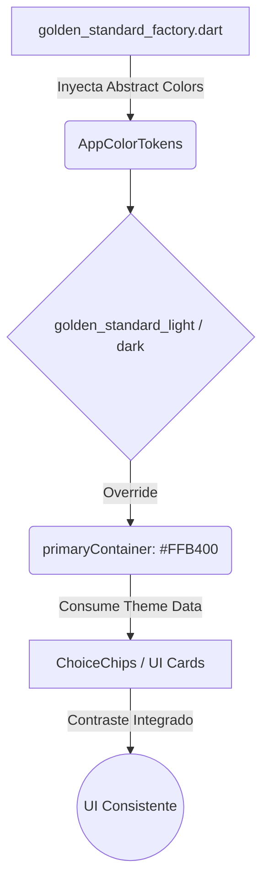

✨ style(theme): Refactorización profunda de "Golden Standard" al identity core #FFB400

## 📝 Resumen General
> [!NOTE]
> Se identificó y resolvió una discrepancia crítica entre la implementación inicial del "Golden Standard" y la especificación de diseño (`DESIGN_SYSTEM.md` y el asset png base). El UI presentaba el tono El Dorado Gold (`#FFB400`) segmentado de forma inconsistente, relegando tonalidades pálidas erróneas al `primaryContainer`.

## 🛠️ Cambios Realizados
- [x] **Theme Tokens (Light/Dark/Factory):** Mapeo 1:1 estricto contra la paleta visual.
- [x] **Primary Container:** Ascendido de `#FFF0C0` a `#FFB400` para garantizar que todo componente de impacto (Botones de swap, tabs activas, íconos de nav bar) radie el oro oficial.
- [x] **OnPrimaryContainer:** Se asignó `#191C1D` (Dark Charcoal) para un contraste automático e impecable dentro del Golden Standard.
- [x] **Secondary/Tertiary Tiering:** Reorganización cruzada de Trust Green (`#28A745`) y Soft Cyan (`#E0F7FA`) sobre sus equivalentes base.
- [x] **Chip Theme Contrast:** Agregado dinámico a las propiedades del theme de Flutter nativo mediante la parametrización del `secondaryLabelStyle`.

### Tabla Orientativa de Tokens Adaptados
| Token de Tema | Hexadecimal | Aplicación Core |
|---------|---------|---------|
| `primaryContainer` | `#FFB400` | CTAs, Toggles circulares, Underlines activos |
| `onPrimaryContainer` | `#191C1D` | Iconos de acción sobre oro, Label de ChoiceChips |
| `secondary` | `#E0F7FA` | Canvas cyan o textos highlight oscuro-claro |
| `tertiary` | `#28A745` | Componentes vinculados a success y reputación positiva |

## 📐 Arquitectura Afectada (Mermaid)

## 🐛 Bug Fixes
- Contrast Ratio para el estado "selected" del componente base `ChoiceChip` en `home_screen.dart` estabilizado sin alterar la programación UI.
